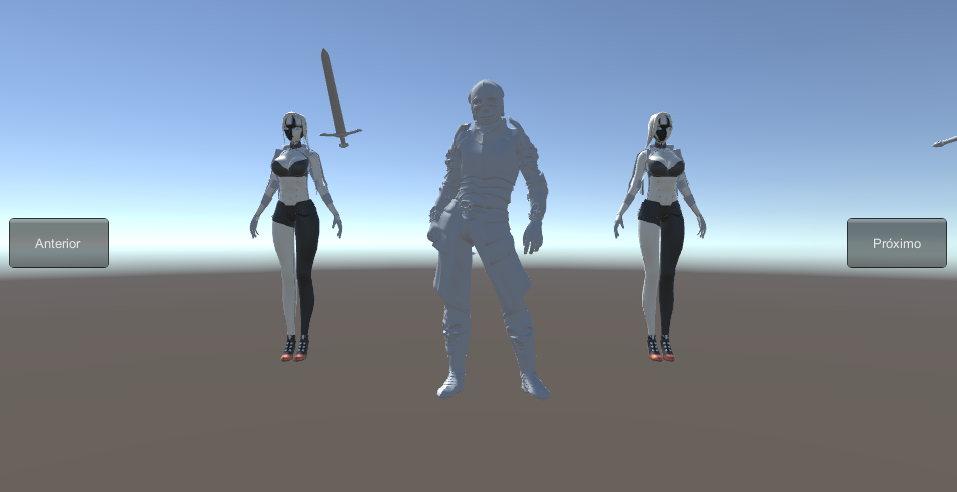

# TelaDeSelecao - Personagem 3D
Por: [***Francisco Henrique***](https://www.linkedin.com/in/francisco-henrique-010912189)

### -Projeto desenvolvido utilizando á *Game Engine* [Unity](https://unity.com/) com C#.

## Objetivo
- Apresentar e disponibilizar uma tela de seleção de personagem, Projeto 3D.

### Descrição
- Tela de seleção 3D dinâmica, mostra o personagem selecionado, e os que estão na direita e esquerda, caso haja alteração de personagem, uma movimentação será feita.

### Modelos 3D 
- [TurboSquid](https://www.turbosquid.com/pt_br/Search/3D-Models/free)
